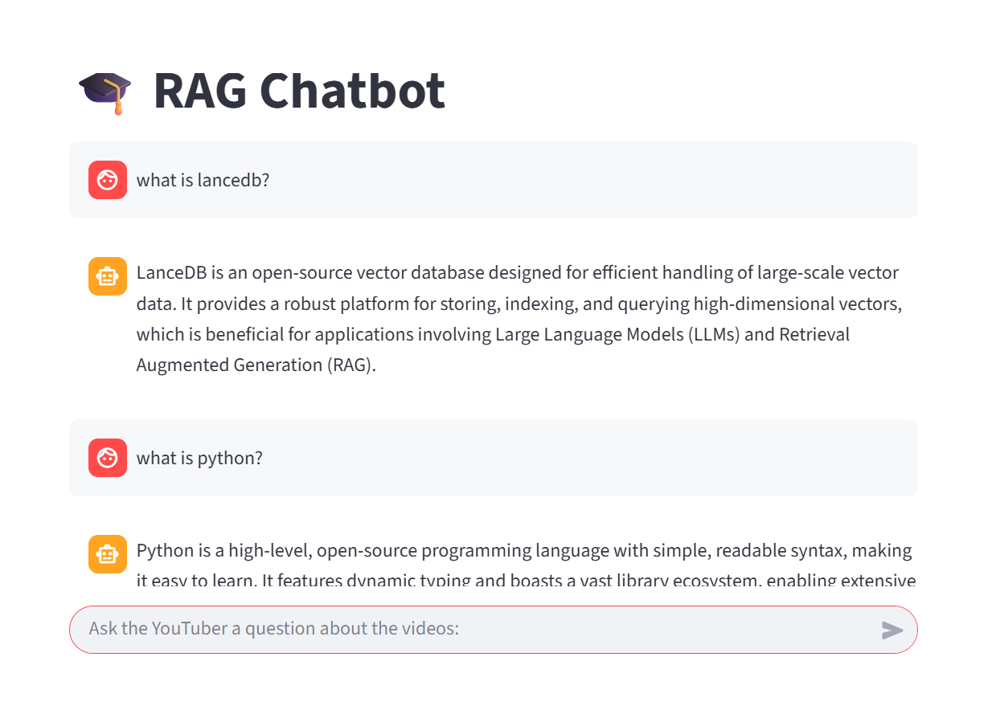

# New_AI_Kanilla
# 🎓  RAG Chatbot

Detta projekt är ett **Proof of Concept (PoC)** för en *Retrieval Augmented Generation (RAG)*-chatbot
baserad på innehåll från en YouTubers videor inom data engineering.

Syftet är att göra det möjligt för följare att ställa frågor och få svar **direkt från videotranskript**,
vilket förbättrar lärandeupplevelsen.

--- Systemet består av fyra huvuddelar:

1. **Data ingestion**
   - Videotranskript delas upp i text-chunks
   - Embeddings skapas
   - Data lagras i **LanceDB** (vektordatabas)

2. **RAG-logik**
   - Frågor omvandlas till embeddings
   - Relevanta chunks hämtas från LanceDB
   - Ett LLM genererar svar baserat på dessa chunks

3. **API**
   - FastAPI används för att exponera RAG-systemet via HTTP
   - Endpoint: `POST /rag/query`

4. **Frontend**
   - En chatbaserad frontend byggd med **Streamlit**
   - Användaren kan ställa frågor och se svar + källor

## Projektstruktur

New_AI_Kanilla/
│
├── backend/
│   ├── rag.py              # RAG-agent + retrieval-logik
│   ├── constants.py        # Sökvägar och konstanter
│   └── data_models.py      # Pydantic-modeller
│
├── data/
│   ├── transcripts/        # Videotranskript (.md/.txt)
│   └── lancedb/            # Vector database
│
├── frontend/
│   └── app.py              # Streamlit-app
│
├── ingestion.py            # Ingestionsscript
├── api.py                  # FastAPI-app
├── pyproject.toml
└── README.md

för att Skapa vector-databasen körs = uv run python ingestion.py
för att Starta API:t körs = uv run python -m uvicorn api:app --reload
för att Starta frontend körs = uv run python -m streamlit run frontend/app.py

